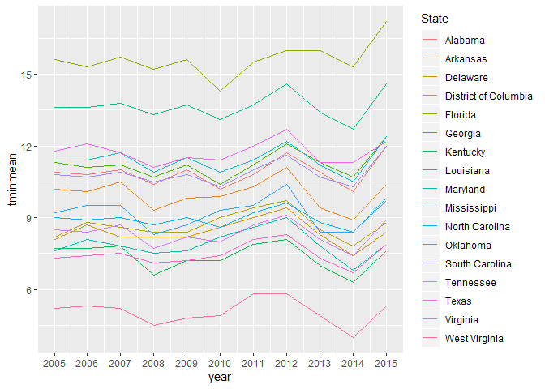
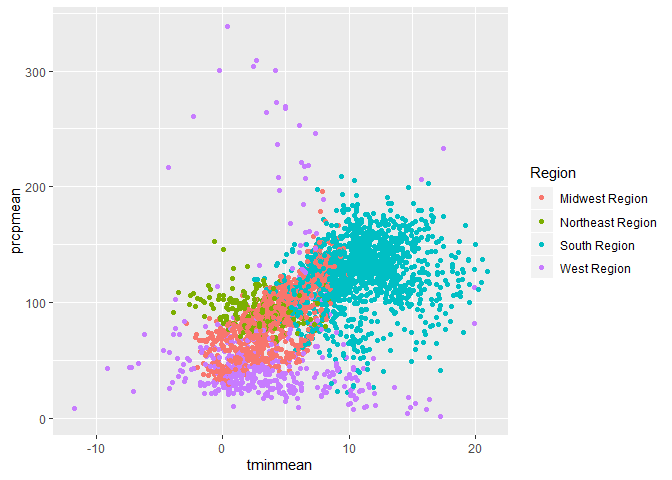

Lab 1: Your responses
================

Your name: Adam Ansley

In the spaces below, insert your code and/or explanation as notes. Look
for the angle brackets-{like these}-for where a response is needed. You
do NOT need to keep the angle brackets in your response–they’re just a
placeholder.

When you are done, click on the arrow next to “knit” and choose “Knit to
github\_document”

Load the data and the tidyverse package in the code chunk below

``` r
#Load the data here
#setwd("C:Users/spock/Documents/GEOG-Labs/data")
labData <- read.csv(file = "data/Daymet_Cty_Summary_2005_2015.csv", fileEncoding="UTF-8-BOM")
```

***Question 1 (4 points):** After loading the file into R, pick TWO
variables and classify them as nominal, ordinal, interval, and ratio
data. Justify the classification you chose in a sentence or two for each
one.*

prcp - Ratio

State - Nominal

***Question 2 (4 points):** Use group\_by and summarise to calculate the
mean minimum temperature and mean precipitation for each year by county,
also including State and Region as grouping variables. Your resulting
dataset should show the value of tmin for each county in each year. Use
the kable and head functions as shown above to call the resulting
table.*

``` r
dataSummary <- group_by(labData, CTY_NAME, year, State, Region) %>%
  summarise(tminmean = mean(tmin), prcpmean = mean(prcp))
kable(head(dataSummary), format = "markdown")
```

| CTY\_NAME | year | State          | Region       |  tminmean | prcpmean |
| :-------- | ---: | :------------- | :----------- | --------: | -------: |
| Abbeville | 2005 | South Carolina | South Region | 10.362186 | 107.1667 |
| Abbeville | 2006 | South Carolina | South Region | 10.322657 |  78.7500 |
| Abbeville | 2007 | South Carolina | South Region | 10.500320 |  62.2500 |
| Abbeville | 2008 | South Carolina | South Region |  9.807594 |  82.2500 |
| Abbeville | 2009 | South Carolina | South Region | 10.170424 | 122.5000 |
| Abbeville | 2010 | South Carolina | South Region |  9.905735 |  73.7500 |

***Question 3 (2 points):** What if we were only interested in the South
Region? Filter the data frame you created in question 2 to just include
counties in this region. Then use group\_by and summarise again to
calculate the mean minimum temperature by year for each state. For 1
point extra credit, use the round function to include only 1 decimal
point. Use kable and head to call the first few lines of the resulting
table*

``` r
southsumary <- filter(dataSummary, Region == "South Region") %>%
  group_by(State, year) %>%
  summarise(tminmean = round(mean(tminmean), 1), prcpmean = round(mean(prcpmean), 1))
kable(head(southsumary), format = "markdown")
```

| State   | year | tminmean | prcpmean |
| :------ | ---: | -------: | -------: |
| Alabama | 2005 |     10.9 |    126.9 |
| Alabama | 2006 |     10.8 |    104.3 |
| Alabama | 2007 |     11.0 |     80.5 |
| Alabama | 2008 |     10.4 |    120.4 |
| Alabama | 2009 |     11.0 |    169.1 |
| Alabama | 2010 |     10.2 |    105.7 |

***Question 4 (3 points):** To visualize the trends, we could use ggplot
to visualize change in mean temperature over time. Create a line plot
(geom\_line) showing the state means you calculated in question 3. Use
the color parameter to show separate colors for each state.*

``` r
ggplot(data = southsumary, aes(x = year, y = tminmean)) + 
  geom_line(aes(color = State)) + 
  scale_x_continuous(name = "year", breaks = scales::pretty_breaks(n = 11), labels = waiver())
```

<!-- -->

***Question 5 (3 points):** If you wanted to look at these data as a
table, you’d need to have it in wide format. Use the spread function to
create a wide format version of the data frame you created in question
3. Then call the whole table using kable.*

``` r
southspread <- select(southsumary, -4) %>%
spread(year, tminmean)
kable(head(southspread))
```

| State                | 2005 | 2006 | 2007 | 2008 | 2009 | 2010 | 2011 | 2012 | 2013 | 2014 | 2015 |
| :------------------- | ---: | ---: | ---: | ---: | ---: | ---: | ---: | ---: | ---: | ---: | ---: |
| Alabama              | 10.9 | 10.8 | 11.0 | 10.4 | 11.0 | 10.2 | 10.8 | 11.7 | 10.9 | 10.1 | 12.0 |
| Arkansas             | 10.2 | 10.1 | 10.5 |  9.3 |  9.8 |  9.9 | 10.3 | 11.1 |  9.4 |  8.9 | 10.4 |
| Delaware             |  8.1 |  8.7 |  8.2 |  8.2 |  8.2 |  8.6 |  9.0 |  9.4 |  8.3 |  7.4 |  8.4 |
| District of Columbia |  8.2 |  8.8 |  8.6 |  8.4 |  8.4 |  9.0 |  9.4 |  9.7 |  8.5 |  7.8 |  8.8 |
| Florida              | 15.6 | 15.3 | 15.7 | 15.2 | 15.6 | 14.3 | 15.5 | 16.0 | 16.0 | 15.3 | 17.2 |
| Georgia              | 11.3 | 11.1 | 11.2 | 10.7 | 11.2 | 10.4 | 11.2 | 12.1 | 11.3 | 10.7 | 12.4 |

***Question 6 (4 points):** Returning to the county table you created in
question 2, filter the data to only include 2015 as a year. Then use
ggplot to create a scatterplot (geom\_point) for the minimum temperature
and precipitation variables, coloring the points using the Region
variable.*

``` r
data2015 <- dataSummary %>%
  filter(year == "2015")
  ggplot(data2015, aes(x=tminmean, y=prcpmean)) +
    geom_point(aes(color = Region))
```

<!-- -->
